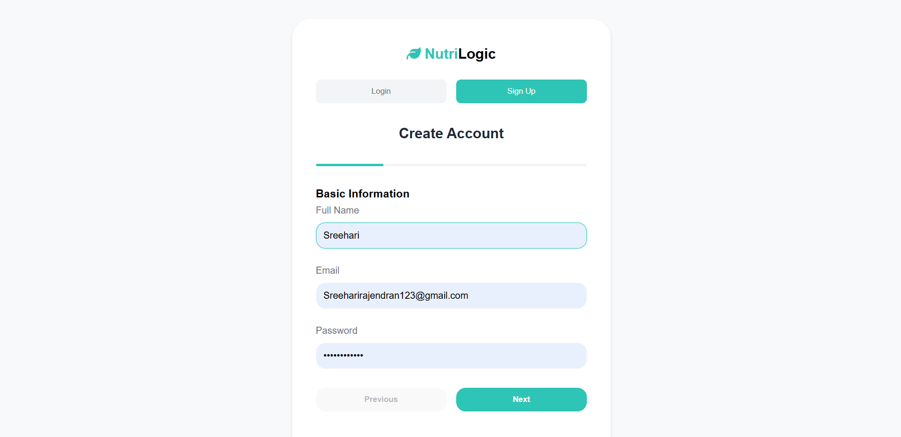
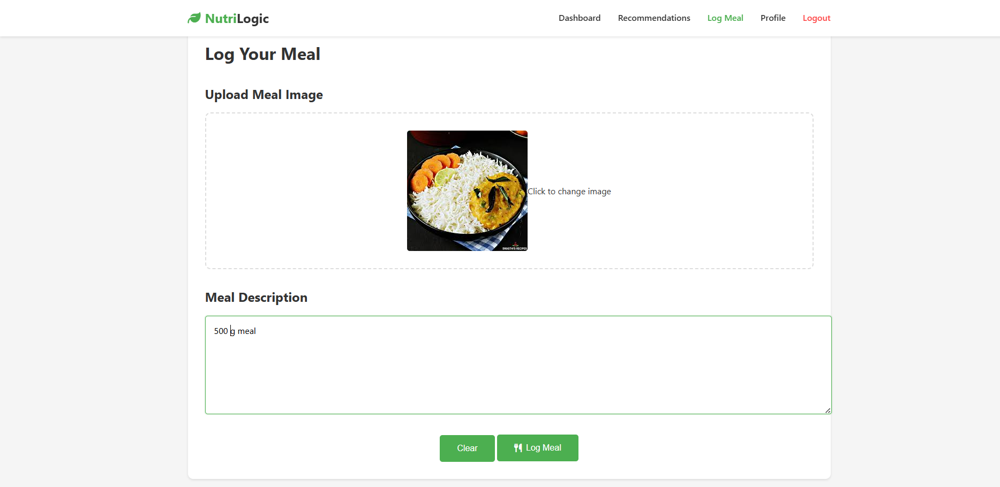
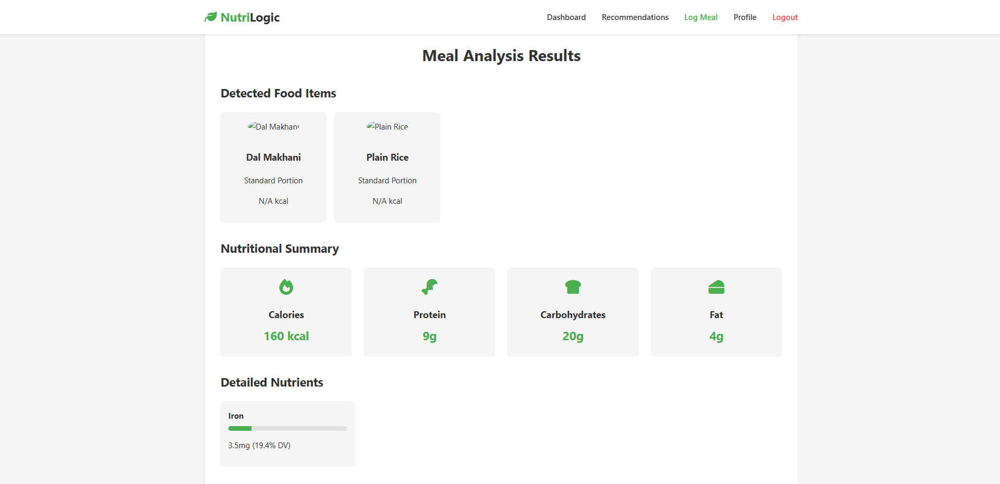
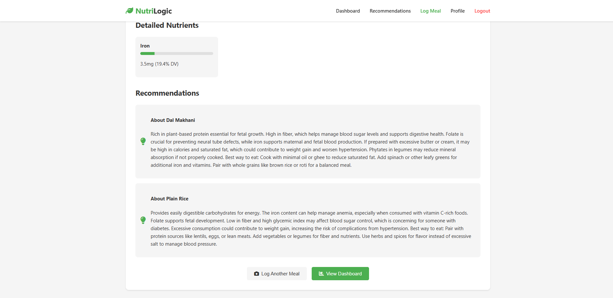
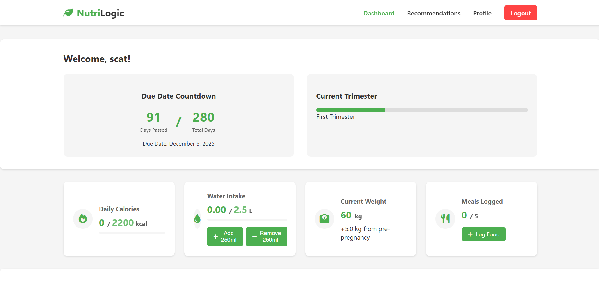
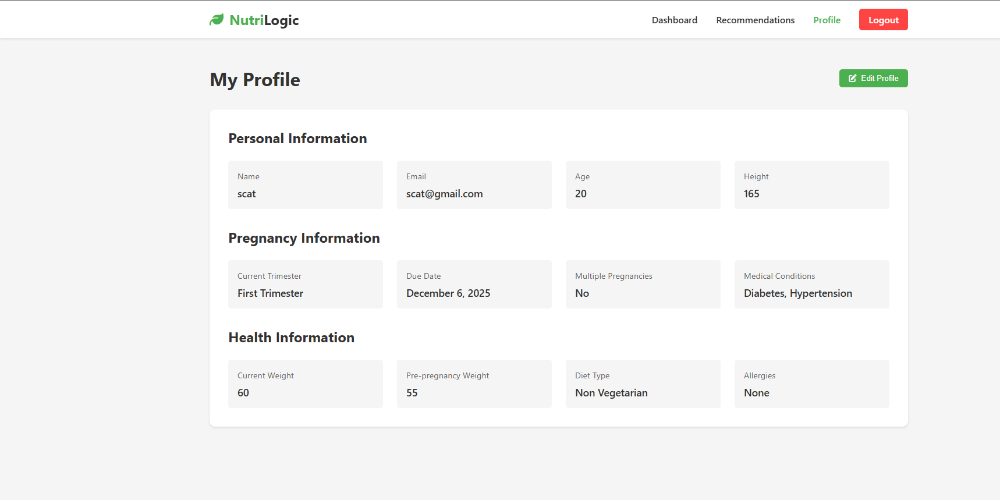
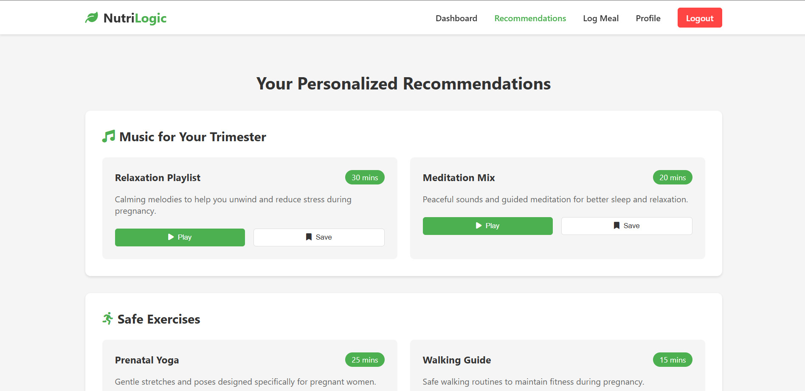

# 🥗 NutriMom – Maternal Nutrition Tracking App

NutriMom is an AI-powered web application that helps pregnant and postpartum individuals track and optimize their nutritional intake. By combining computer vision and LLMs, it automatically analyzes meal images and provides tailored nutritional feedback based on the user's health profile.

---

## 📌 Problem Statement

Pregnancy and postpartum stages require increased nutritional awareness to support both the mother's health and the baby's development. However, tracking nutrients manually can be tedious, and generalized diet plans fail to address individual needs.

**NutriMom** addresses this gap by:
- Automating nutrition tracking via image uploads.
- Providing personalized recommendations based on pregnancy status, medical conditions, and dietary preferences.

---

## 🧠 Approach & Solution

1. **Image-Based Meal Detection**  
   Users upload a photo of their meal. A YOLOv8 model detects the food items present.

2. **Nutrition Estimation via LLM**  
   The detected foods are passed to a language model, which estimates nutrition values (calories, protein, iron, folic acid, etc.), factoring in user profile data like pregnancy trimester and medical history.

3. **Data Logging & Dashboard**  
   Nutritional data is stored in a local SQLite database, enabling users to track their progress and dietary habits over time.

---

## ✨ Features

- 📷 **Meal Image Upload** – Detect food items using AI.
- 🍽️ **LLM-Powered Nutrition Analysis** – Personalized nutrient estimates.
- 👩‍🍼 **Pregnancy-Aware Feedback** – Adjusted to trimester, medical conditions, and dietary restrictions.
- 📊 **Daily Meal Log** – Dashboard to track nutrient intake.
- 🔒 **User Authentication** – Secure login and session tracking.
- 🧾 **SQLite Integration** – Persistent meal and user history.

---

## 🛠️ Tech Stack

| Layer              | Tools Used                                           |
|-------------------|------------------------------------------------------|
| **Frontend**       | HTML, CSS, JavaScript (Vanilla)                      |
| **Backend**        | Python, Flask                                        |
| **Database**       | SQLite                                               |
| **Image Processing** | Roboflow Inference API (YOLOv8 model)              |
| **Language Model** | Custom Prompt-Chained LLM (via `llm_chains.py`)     |
| **Authentication** | Flask-Login                                          |
| **Deployment**     | Localhost (dev); Ready for cloud deployment          |

---

## 📸 Screenshots

### 🔐 SignUp Page


### 🖼️ Upload Meal Image


### AI Powered Meal Detection, Analysis & Recommendations



### 📊 Nutrition Dashboard


### User Profile


### Personalised Recommendations(Not Completed)


---

## 🚀 Run Instructions

### ⚙️ 1. Clone the Repository
```bash
git clone https://github.com/your-username/nutrimom.git
cd nutrimom
cd src/foodscanner
py app.py
